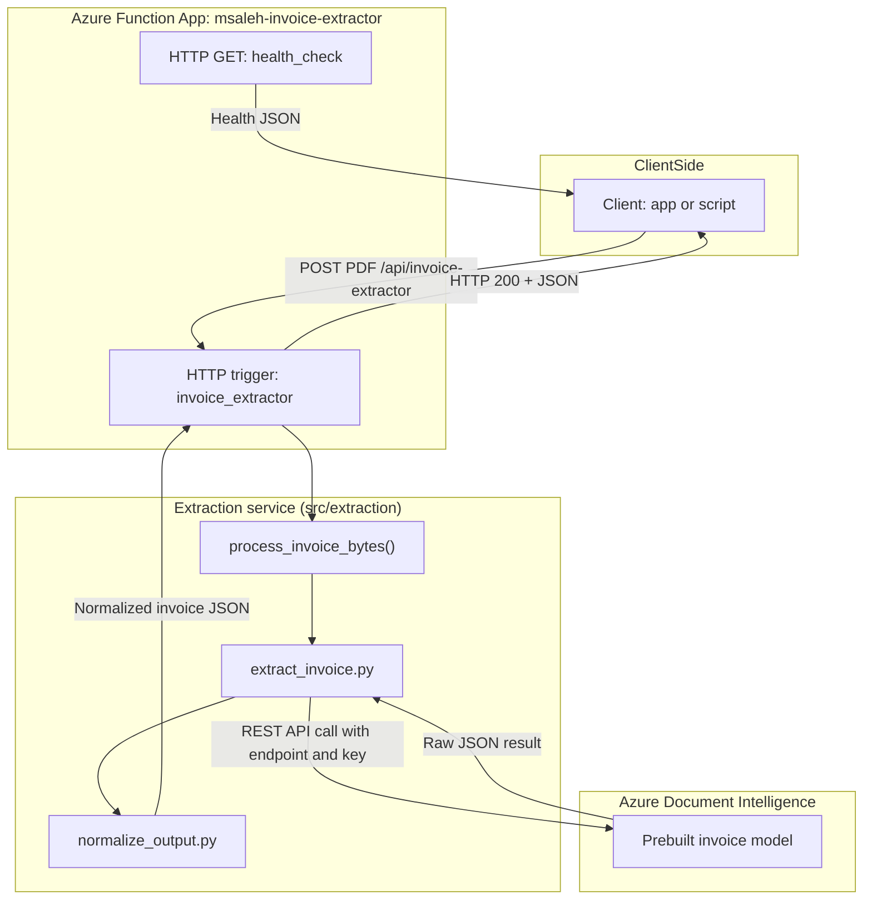

# Azure Serverless Invoice Extraction API

A production-style **serverless invoice extraction API** built with:

- **Azure Functions (Python)** — lightweight, auto-scaling, cost-efficient.
- **Azure Document Intelligence (Prebuilt Invoice)** — extracts invoice fields with high accuracy.
- **GitHub Actions CI/CD** — automated testing, tag-based deployments, post-deploy health validation.
- **Application Insights** — availability tests, alerts, and telemetry.

Upload any PDF invoice → get back **clean, normalized JSON** containing header fields, vendor info, totals, currency, and line items.

---

## Features

### AI-Powered Invoice Extraction
- Calls **Azure Document Intelligence v4** (`2023-07-31` API)
- Extracts structured fields:
  - invoice ID, dates, totals, vendor/customer info
  - currencies, taxes
  - line items (description, quantity, price, amount)
  - confidence scores

### Serverless Architecture
- Azure Functions (Flex Consumption)
- Fast cold starts, low cost, auto-scale on demand
- Stateless design

### Clean & Maintainable Code
- Shared extraction service: `process_invoice_bytes()`  
- Clear separation of:
  - HTTP layer (Azure Functions)
  - Business logic (`src/extraction`)
  - Normalization (`normalize_output.py`)

### Reliability & Observability
- `/api/health` readiness endpoint
- Application Insights **Standard Availability Test** (every 5 minutes)
- Alert rule: **failed locations ≥ 1**
- GitHub Actions **post-deploy health check**
- Full CI pipeline with pytest + compile checks

---

## Architecture Overview



---

## 📂 Project Structure

```text
.
├── .github/
│   └── workflows/
│       ├── ci.yml                     # Tests, coverage, compile check
│       └── deploy-azure-function.yml  # Tag-based deploy + health verification
├── azure/
│   ├── architecture.md
│   ├── system_design.md
│   └── API_REFERENCE.md
├── fastapi_app/
│   ├── main.py                        # Optional FastAPI version
│   └── README.md                      # Description of FastAPI usage
├── functions/
│   ├── host.json
│   ├── requirements.txt
│   ├── invoice_extractor/
│   │   ├── __init__.py                # Azure Function (HTTP POST)
│   │   └── function.json
│   └── health_check/
│       ├── __init__.py                # /api/health endpoint
│       └── function.json
├── src/
│   └── extraction/
│       ├── extract_invoice.py         # Calls Azure DI REST API
│       ├── normalize_output.py        # Cleans & structures DI output
│       └── service.py                 # process_invoice_bytes()
├── tests/                             # Pytest suite
├── postman/                           # Postman ready to import environment and collection
├── samples/
│   ├── example_invoice_1.pdf
└── README.md
```

---

## Testing with Postman

This project includes ready‑to‑use Postman files under:

```
/postman/
├── Azure_Serverless_Invoice_Extractor.postman_collection.json
└── Invoice_API_Production.postman_environment.json
```

### 1. Import into Postman
- Open Postman → **Import**
- Select both files from `/postman`
- Postman creates:
  - **Collection**: Invoice Extraction API  
  - **Environment**: Invoice_API_Production  

### 2. Select Environment
Choose the environment in the top‑right of Postman.

To test locally:
```
base_url = http://localhost:7071
```

To test production:
```
base_url = https://<your-function>.azurewebsites.net
```

### 3. Test Invoice Extraction
- Open **POST – Invoice Extractor**
- Body → **Binary** → select a PDF (e.g. `samples/example_invoice_1.pdf`)
- Click **Send**
- You receive normalized JSON.

### 4. Test Health Check
- Open **GET – Health Check**
- Click **Send**
- Expect:
```json
{"status": "ok", "...": "..."}
```

This allows quick and reliable testing of both local and deployed versions of the API.

---

## Local Development

### 1. Install dependencies

```bash
cd functions
python -m venv .venv
source .venv/bin/activate  # Windows: .venv\Scripts\activate
pip install -r functions/requirements.txt
```

### 2. Configure environment variables

Create `functions/local.settings.json`:

```json
{
  "IsEncrypted": false,
  "Values": {
    "AzureWebJobsStorage": "UseDevelopmentStorage=true",
    "FUNCTIONS_WORKER_RUNTIME": "python",
    "DOCINT_ENDPOINT": "https://<your-resource>.cognitiveservices.azure.com/",
    "DOCINT_KEY": "<your-key>",
    "APP_VERSION": "v0.0.0-local"
  }
}
```

### 3. Run Azure Functions host locally

```bash
func start
```

---

## Testing the API (curl)

### Extract an invoice

```bash
curl -X POST   -H "Content-Type: application/pdf"   --data-binary "@samples/example_invoice_1.pdf"   "http://localhost:7071/api/invoice-extractor"
```

### Health check

```bash
curl http://localhost:7071/api/health
```

---

## Production Deployment (GitHub Actions → Azure Functions)

Deployments are **tag-driven**.

### 1. Create a new version tag

```bash
git tag v1.0.0
git push origin main --tags
```

### 2. GitHub Actions workflow does the rest:

- Installs deps  
- Copies `src/` into the packaged folder  
- Deploys `/functions` to Azure  
- **Calls `/api/health` after deploy**:
  - If not 200 → deploy fails  
  - Prevents broken releases from going live  

---

## Monitoring, Availability & Alerts

### 1. `/api/health` endpoint  
Returns:

```json
{
  "status": "ok",
  "service": "invoice-extraction-api",
  "timestamp_utc": "2025-12-03T19:00:00Z",
  "version": "v1.0.0",
  "checks": [
    { "name": "environment", "status": "ok" },
    { "name": "document_intelligence", "status": "ok" }
  ]
}
```

### 2. Application Insights — Availability Test
- Tests `/api/health` every 5 minutes from multiple regions
- Measures uptime & latency

### 3. Alert Rule
Triggers when:

```
failed_locations ≥ 1
```

---

## API Summary

### `POST /api/invoice-extractor`
- Input: PDF (`Content-Type: application/pdf`)
- Output: Normalized JSON
- Status:
  - 200 → Success
  - 400 → Invalid input
  - 500 → Failure contacting Azure DI

### `GET /api/health`
- Simple readiness check
- Returns 200 if healthy

---

## Roadmap
- Add ruff linting  
- Add coverage thresholds  
- Blob-trigger for batch invoices  
- Persist extraction results  
- Add authentication  

---

## Portfolio Summary

This project demonstrates:

- Serverless architecture  
- Intelligent document processing  
- Azure Functions & Azure Document Intelligence  
- CI/CD pipelines  
- Monitoring, availability & alerts  
- Clean, testable Python design  
