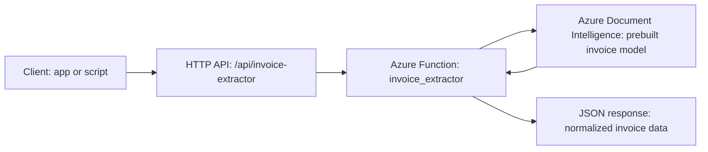
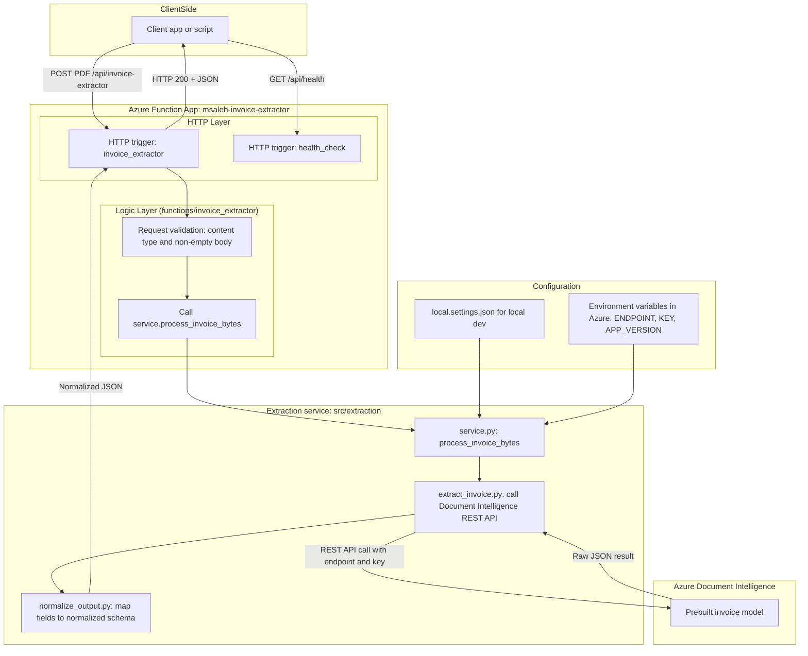

# Architecture — Azure Serverless Invoice Extraction Service

This document describes the **high-level architecture** of the Azure Serverless Invoice Extraction Service.

The goal of the system is to provide a **small, production-style HTTP API** that:
- Accepts a PDF invoice via HTTP,
- Uses **Azure Document Intelligence (prebuilt invoice model)** to extract fields,
- Normalizes the raw result into a clean JSON schema,
- Exposes operational hooks for **health checks, monitoring, and CI/CD validation**.

---

## 1. High-Level Architecture

At a high level, the system looks like this:

**Narrative:**

1. A client (script, backend service, Postman, etc.) sends a `POST` request with a PDF body to `/api/invoice-extractor`.
2. The Azure Function `invoice_extractor` validates the request and delegates to the Python service layer.
3. The service sends the PDF bytes to **Azure Document Intelligence (Form Recognizer v4)** using the **prebuilt invoice** model.
4. Once the analysis completes, the raw result is normalized into a consistent schema.
5. The Function returns a **normalized JSON** response to the client.

The same Function App also exposes a **health check endpoint**, `/api/health`, which is used by monitoring and CI/CD.

---

## 2. Detailed Component View

### 2.1 Components

- **Client app or script**
  - Any system capable of making HTTP requests (Python script, backend service, Postman, etc.).
  - Sends PDF invoices to the API and consumes normalized JSON.

- **Azure Function App — `msaleh-invoice-extractor`**
  - **HTTP trigger: `invoice_extractor`**
    - Entry point for `POST /api/invoice-extractor`.
    - Validates the request (non-empty body, PDF content type).
    - Delegates work to `process_invoice_bytes(...)`.
  - **HTTP trigger: `health_check`**
    - Entry point for `GET /api/health`.
    - Returns a lightweight JSON payload with:
      - health status,
      - application version (`APP_VERSION`),
      - UTC timestamp.
    - Used by Application Insights availability tests and GitHub Actions post-deploy checks.

- **Extraction service (`src/extraction`)**
  - **`service.py`**
    - Defines `process_invoice_bytes(pdf_bytes)`.
    - Coordinates:
      - Document Intelligence call (`extract_invoice`),
      - normalization (`normalize_invoice`),
      - error handling.
  - **`extract_invoice.py`**
    - Constructs the request to **Azure Document Intelligence**.
    - Uses `DOCINT_ENDPOINT` and `DOCINT_KEY` from configuration.
    - Calls the **prebuilt invoice model** (Form Recognizer v4).
    - Polls the operation URL until analysis completes.
  - **`normalize_output.py`**
    - Converts the raw Azure DI response into a stable JSON schema.
    - Extracts header fields, totals, and line items.
    - Produces a predictable, client-friendly structure.

- **Configuration layer**
  - **`local.settings.json`**
    - Used during local development with Azure Functions Core Tools.
    - Stores keys like `DOCINT_ENDPOINT`, `DOCINT_KEY`, `AzureWebJobsStorage`, and optional `APP_VERSION`.
  - **Environment variables in Azure**
    - Managed via Function App **Environment variables** / **Configuration**.
    - Includes:
      - `DOCINT_ENDPOINT`
      - `DOCINT_KEY`
      - `APP_VERSION`
      - `AzureWebJobsStorage`
      - `FUNCTIONS_WORKER_RUNTIME=python`

- **Azure Document Intelligence (Form Recognizer v4)**
  - Cognitive service that performs the heavy lifting of invoice understanding.
  - The service uses the **prebuilt invoice** model to extract fields.

---

## 3. Physical Architecture

Physically, the system spans:

1. **Azure Function App (Flex Consumption)**
   - Hosts the HTTP endpoints.
   - Runs Python code for invoice extraction and health checks.
   - Scales automatically based on load.

2. **Azure Document Intelligence resource**
   - Deployed in a compatible region.
   - Exposed via a REST API endpoint and an API key.
   - Called directly from the Function App.

3. **Azure Storage Account**
   - Required for Azure Functions (host state and logs).
   - The current design does not yet persist invoices or results, but this is a natural next step.

4. **Application Insights**
   - Telemetry for the Function App.
   - Hosts the **Availability Test** that periodically calls `/api/health`.
   - Used by alert rules to notify when availability degrades.

5. **GitHub (CI/CD)**
   - Hosts the code in the `azure-serverless-invoice-extraction` repository.
   - Runs CI and deploy workflows via GitHub Actions.

---

## 4. CI/CD and Operational Architecture

The operational pipeline is an important part of the architecture.

### 4.1 CI — Continuous Integration

- Workflow: `.github/workflows/ci.yml`
- Trigger: every push and pull request to `main`.
- Responsibilities:
  - Set up Python.
  - Install dependencies from `functions/requirements.txt`.
  - Run tests with coverage against `src` (and `fastapi_app` if used).
  - Run `python -m compileall` on the code to catch syntax errors early.

This ensures that changes are validated before merging and that the core logic remains testable and correct.

### 4.2 CD — Continuous Deployment

- Workflow: `.github/workflows/deploy-azure-function.yml`
- Trigger: whenever a version tag like `v0.4.0` is pushed.
- Responsibilities:
  - Check out the repository.
  - Set up Python.
  - Install dependencies.
  - Prepare the Functions package (including the shared `src/` code).
  - Deploy to Azure Functions using `azure/functions-action@v1` with `remote-build`.
  - **Post-deploy health check**:
    - Calls `{BASE_URL}/api/health`.
    - If the status code is not `200`, the workflow fails the deployment.

This pattern ensures that **a deployment is considered successful only if the new version is healthy**.

---

## 5. Monitoring, Health Checks and Alerts

Monitoring is implemented at two levels:

### 5.1 Internal Health Endpoint

- Endpoint: `GET /api/health`
- Implemented in `functions/health_check/__init__.py`.
- Returns a small JSON payload indicating:
  - Status (`"ok"` when healthy),
  - Source identifier,
  - `APP_VERSION`,
  - UTC timestamp.

### 5.2 External Availability Test

- Configured in **Application Insights**:
  - A **Standard availability test** periodically calls `/api/health` from multiple regions.
  - The test records success/failure and latency over time.
- Alert rule:
  - Trigger when the number of failed locations is ≥ 1 (or similar threshold).
  - Sends a notification if the service becomes unavailable or degraded.

### 5.3 Post-deploy Health Check (CI/CD)

- After each deployment from GitHub Actions:
  - The deploy workflow calls `/api/health`.
  - A non-200 status code causes the deployment job to fail.

This triad (internal health endpoint + availability test + post-deploy check) gives a strong **operational story** for the project.

---

## 6. Extensibility

The architecture is intentionally simple but **extensible**:

- **Additional triggers** could be added:
  - Blob trigger for batch invoice processing from Azure Storage.
  - Queue trigger for asynchronous workflows.
- **Persistence**:
  - Save normalized invoice JSONs to Blob Storage, SQL, or a data lake.
- **Authentication**:
  - Put API Management or a custom auth layer in front of `/api/invoice-extractor`.
- **New models**:
  - Swap or extend the Azure DI model (e.g. custom trained models) with minimal changes to `extract_invoice.py` and `normalize_output.py`.

The separation between HTTP layer, service layer, and external cognitive service makes these kinds of changes easier.

---

This architecture document is kept in sync with the current implementation of the **Azure Serverless Invoice Extraction Service** and the connected CI/CD and monitoring setup.
