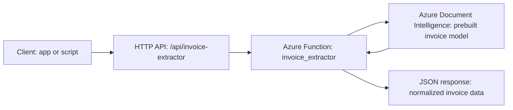
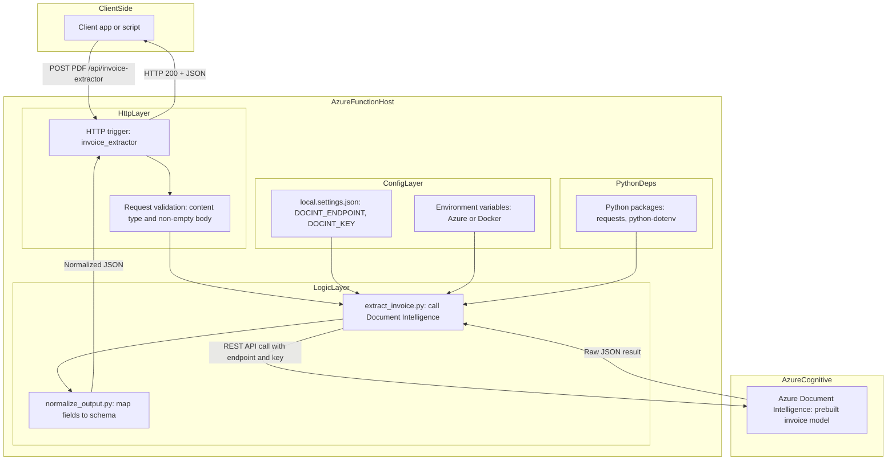

# Azure Invoice Extraction Service — Architecture

This document describes the architecture of the **Azure Invoice Extraction Service**, which turns PDF invoices into structured JSON using **Azure Document Intelligence** and an **Azure Functions HTTP API**.

---

## 1. High-Level Overview (Simple Diagram)



---

## 2. Detailed Architecture (Components & Layers)



---

## 3. Data Flow (Step-by-Step)

1. **Client Upload**  
   Client sends `POST /api/invoice-extractor` with a PDF body.

2. **HTTP Trigger**  
   Azure Function receives the HTTP request, validates header/body, and returns `400` on invalid input.

3. **Call Azure Document Intelligence**  
   Function reads endpoint/key from environment variables and sends the PDF to Document Intelligence.

4. **Normalization**  
   Raw JSON from Azure DI is transformed into a clean, stable structure.

5. **Response**  
   Function returns `200 OK` with normalized JSON, or structured error codes on failure.

---

## 4. Deployment Considerations

### Local Development (Docker)
```powershell
docker run --rm -it `
  -p 7071:80 `
  -v D:\GitHub\06_invoice-extraction-azure:/home/site/wwwroot `
  -e AzureWebJobsScriptRoot=/home/site/wwwroot `
  mcr.microsoft.com/azure-functions/python:4-python3.10
```

### Cloud Deployment (Azure Function App)
1. Create a Function App + Storage Account  
2. Add environment variables in **Configuration**  
3. Deploy using VS Code or Azure CLI  
4. API endpoint becomes:  
   ```
   https://<your-func-app>.azurewebsites.net/api/invoice-extractor
   ```

---

## 5. Why This Architecture

- **Serverless** — no server management, pay-per-execution  
- **Modular** — extraction & normalization logic isolated  
- **Cloud-native AI** — relies on Azure Document Intelligence  
- **Portable** — runs locally via Docker, deployable to Azure  
- **Extensible** — easy to add auth, logging, storage, batching, etc.  

