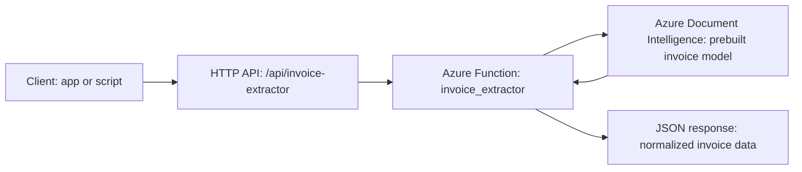
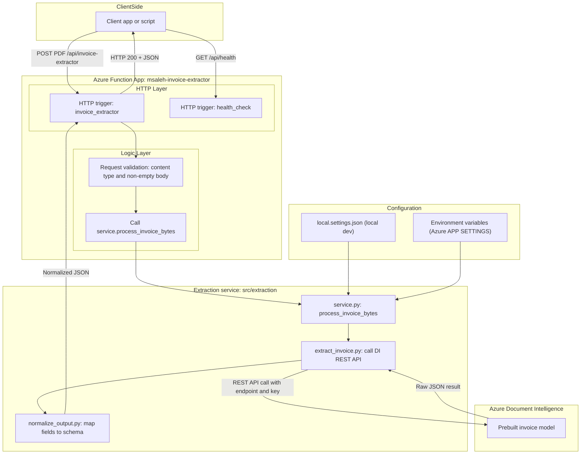

# System Design — Azure Serverless Invoice Extraction Service

This document explains the **detailed system design** of the Azure Serverless Invoice Extraction Service.

The goal is to show *how* the system fulfills its requirements using Azure Functions, Azure Document Intelligence, and a small, testable Python codebase with CI/CD and monitoring.

---

## 1. Goals and Requirements

### 1.1 Functional Requirements

- Accept a **single PDF invoice** via HTTP.
- Use **Azure Document Intelligence (prebuilt invoice model)** to extract fields.
- Normalize the raw response into a **stable JSON schema** with:
  - Invoice header information (ID, dates, vendor, customer).
  - Monetary fields (totals, taxes).
  - Line items (description, quantity, unit price, amount).
- Expose a **health endpoint** that can be used by:
  - Application Insights availability tests.
  - CI/CD deployments (post-deploy smoke check).

### 1.2 Non-Functional Requirements

- **Scalable**: Handle bursts of requests with minimal operational overhead.
- **Resilient**: Fail explicitly when configuration is missing or the external AI service is unavailable.
- **Observable**: Support health checks, uptime tests, and alerts.
- **Testable**: Business logic separated from HTTP layer, testable with `pytest`.
- **Deployable**: Automated CI/CD via GitHub Actions, with post-deployment validation.

---

## 2. High-Level Design

At a high level, the system is a thin HTTP API in front of Azure Document Intelligence:



There is also a dedicated `/api/health` endpoint, implemented as a separate HTTP-triggered function, used by monitoring and CI/CD workflows.

---

## 3. Detailed Component Design



### 3.1 HTTP Layer (Azure Functions)

- **Function App**: `msaleh-invoice-extractor`
- **Function: `invoice_extractor`**
  - Trigger: HTTP (`POST`).
  - Route: `/api/invoice-extractor`.
  - Responsibilities:
    - Validate that the request has:
      - Non-empty body.
      - `Content-Type: application/pdf`.
    - Read the PDF bytes from the request.
    - Call `process_invoice_bytes(pdf_bytes)` from `src/extraction/service.py`.
    - Map Python exceptions to **HTTP status codes** and a JSON error response.
- **Function: `health_check`**
  - Trigger: HTTP (`GET`).
  - Route: `/api/health`.
  - Responsibilities:
    - Return a small JSON document like:
      - `status` (e.g. `"ok"`).
      - `source` (identifier for the health probe).
      - `app_version` (from `APP_VERSION` environment variable).
      - `timestamp_utc`.
    - Designed to be:
      - Fast.
      - Side-effect-free.
      - Robust (avoids heavy external calls).

### 3.2 Extraction Service (`src/extraction`)

This layer encapsulates the logic for calling Azure Document Intelligence and shaping the response.

- **`service.py`**
  - Defines `process_invoice_bytes(pdf_bytes)`.
  - Responsibilities:
    - Validate that `pdf_bytes` is not empty.
    - Call `extract_invoice(pdf_bytes)` to send the document to Azure DI.
    - Pass the raw result to `normalize_invoice(raw_result)` (in `normalize_output.py`).
    - Handle exceptions and propagate meaningful errors back to the Function.

- **`extract_invoice.py`**
  - Reads configuration from environment:
    - `DOCINT_ENDPOINT`
    - `DOCINT_KEY`
  - Builds the request to Azure Document Intelligence **prebuilt invoice** model.
  - Uses the official REST endpoint for Form Recognizer v4.
  - Handles the asynchronous nature of the API (polling the `operation-location` until completion).
  - Returns the raw JSON result (similar to `raw_output_example.json`).

- **`normalize_output.py`**
  - Converts the raw DI response into a **simplified, stable schema** used by this project.
  - Extracts fields such as:
    - `invoice_id`
    - `invoice_date`, `due_date`
    - `vendor_name`, `customer_name`
    - `total_amount`, `total_tax`
    - `items[]` with `description`, `quantity`, `unit_price`, `amount`
    - `confidence`
  - Produces results compatible with `samples/normalized_output_example.json`.

### 3.3 Configuration

Configuration is deliberately simple and environment-based:

- **Local development**: `functions/local.settings.json`
  - Holds keys like:
    - `AzureWebJobsStorage`
    - `FUNCTIONS_WORKER_RUNTIME`
    - `DOCINT_ENDPOINT`
    - `DOCINT_KEY`
    - `APP_VERSION` (optional, but useful for health reporting).

- **Azure deployment**: Environment variables / App Settings
  - Managed in the Function App via **Environment variables / Configuration**.
  - Mirror the local settings, but never committed to source control.

This approach keeps secrets out of the repository and allows different values per environment.

---

## 4. Data Model

### 4.1 Raw Azure Document Intelligence Output

The Azure DI prebuilt invoice model returns a relatively verbose JSON structure. An example is stored in:

- `samples/raw_output_example.json`

This includes pages, fields, bounding boxes, confidence scores, and other detailed metadata.

### 4.2 Normalized Output Schema

The normalized output is intentionally simpler. It focuses on the fields most commonly needed by downstream systems, and is shaped like:

```json
{
  "invoice_id": "INV-100",
  "invoice_date": "2019-11-15",
  "due_date": "2019-12-15",
  "vendor_name": "CONTOSO LTD.",
  "vendor_address": null,
  "customer_name": "MICROSOFT CORPORATION",
  "total_amount": 110.0,
  "total_tax": 10.0,
  "items": [
    {
      "description": "Consulting Services",
      "quantity": 2,
      "unit_price": 30.0,
      "amount": 60.0
    },
    {
      "description": "Document Fee",
      "quantity": 3,
      "unit_price": 10.0,
      "amount": 30.0
    },
    {
      "description": "Printing Fee",
      "quantity": 10,
      "unit_price": 1.0,
      "amount": 10.0
    }
  ],
  "confidence": 1.0
}
```

> This example is aligned with `samples/normalized_output_example.json`.

### 4.3 Rationale

- **Stability**: The schema is less likely to change than Azure DI’s raw output.
- **Simplicity**: Downstream systems get exactly what they need for storage, analytics, or reconciliation.
- **Extensibility**: Additional fields can be added to the normalized schema later (e.g. tax numbers, purchase order IDs) without exposing the full complexity of the DI response.

---

## 5. Error Handling Strategy

Error handling is shared between the HTTP layer and the service layer:

- **Input validation errors** (empty body, wrong content-type):
  - Handled in the HTTP layer for `invoice_extractor`.
  - Return **400 Bad Request** with a JSON error payload.
- **Configuration errors** (missing endpoint/key):
  - Detected early in `extract_invoice.py`.
  - Raise a clear exception stating which variables are missing.
  - Mapped to a 5xx error (e.g. 500 or 502) by the Function.
- **Azure DI call failures** (network issues, non-200 responses):
  - Wrapped with a descriptive message.
  - Exposed upstream as 5xx errors.
- **Unexpected exceptions**:
  - Caught by a generic error handler in the Function.
  - Returned as **500 Internal Server Error** with a generic error message and optional details (for logs).

All responses, including errors, are formatted as JSON for consistency.

---

## 6. Non-Functional Design

### 6.1 Scalability

- **Azure Functions (Flex Consumption)** offers:
  - Automatic scale-out when traffic increases.
  - No need to provision servers.
  - Pay-per-execution model.
- Stateless design:
  - All necessary context is in the request and configuration.
  - No in-memory session state is required.

### 6.2 Performance

- Latency is bounded primarily by **Azure Document Intelligence**.
  - The Function simply forwards bytes, waits for the analysis, and processes the response.
- The code path is optimized to do minimal work outside of the external AI call.
- For very high throughput or large volumes:
  - A queue-based or blob-trigger pattern could be introduced to offload long-running work.

### 6.3 Security

Current sample is unauthenticated by design (for demo and portfolio use). In a production environment, you would typically:

- Enable `function` or `anonymous` + API Management in front of the Function.
- Use **managed identities** or Key Vault to manage secrets (instead of direct environment variables).
- Restrict access at the network level (VNet integration, IP allow lists, etc.).

### 6.4 Observability

- **Application Insights**:
  - Logs, traces, and metrics for the Function App.
  - **Standard Availability Test** calling `/api/health` from multiple regions.
- **Alert Rule**:
  - Fires when the availability test reports failed locations above a certain threshold.
- **CI/CD post-deploy health check**:
  - GitHub Actions deployment workflow calls `/api/health` and fails the job if the status is not 200.

This combination gives good visibility into both **code-level** and **system-level** health.

---

## 7. CI/CD Design

### 7.1 Continuous Integration (`ci.yml`)

- Triggered on:
  - `push` to `main`
  - `pull_request` targeting `main`
- Steps:
  - Check out the code.
  - Set up Python.
  - Install dependencies using `functions/requirements.txt`.
  - Run `pytest` with coverage for the service and supporting code.
  - Run `python -m compileall` to catch syntax errors in `src`, `fastapi_app`, and `functions`.

### 7.2 Continuous Deployment (`deploy-azure-function.yml`)

- Triggered by **version tags** (e.g. `v0.4.0`).
- Steps:
  - Check out the repository.
  - Set up Python.
  - Install dependencies.
  - Prepare the deployment package (including `src/`).
  - Deploy to Azure Functions using `azure/functions-action@v1` with `remote-build`.
  - **Post-deploy health check**:
    - Make an HTTP GET call to `/api/health`.
    - If the response is not `200 OK`, mark the deploy as failed.

This pattern ensures:

- Every deployment is trackable via a version tag.
- CI and CD are separate but coordinated.
- The service is validated *after* deployment, not just in tests.

---

## 8. Future Improvements

The design intentionally leaves room for growth:

- **Triggers**:
  - Blob-triggered function to process invoices dropped into a Storage container.
  - Queue-triggered function for asynchronous workloads.
- **Persistence**:
  - Store normalized invoices in:
    - Azure Blob Storage (as JSON).
    - Azure SQL / PostgreSQL for querying and reconciliation.
    - A data lake for analytics.
- **Authentication & authorization**:
  - Protect `/api/invoice-extractor` with API keys, OAuth2/JWT, or Azure AD.
  - Expose the API through Azure API Management for rate limiting and quotas.
- **Extended schema**:
  - Include additional fields from the DI response (e.g. tax IDs, payment terms).
  - Support multiple invoices per document.
- **Cost optimization**:
  - Batch invoices when appropriate.
  - Use asynchronous patterns for long-running operations.

---

This system design document is kept in sync with the current implementation of the **Azure Serverless Invoice Extraction Service**, including its health check, service layer, CI/CD pipeline, and monitoring setup.
